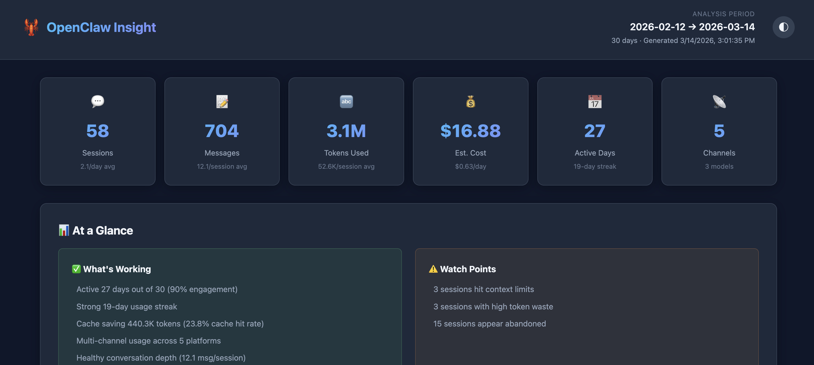
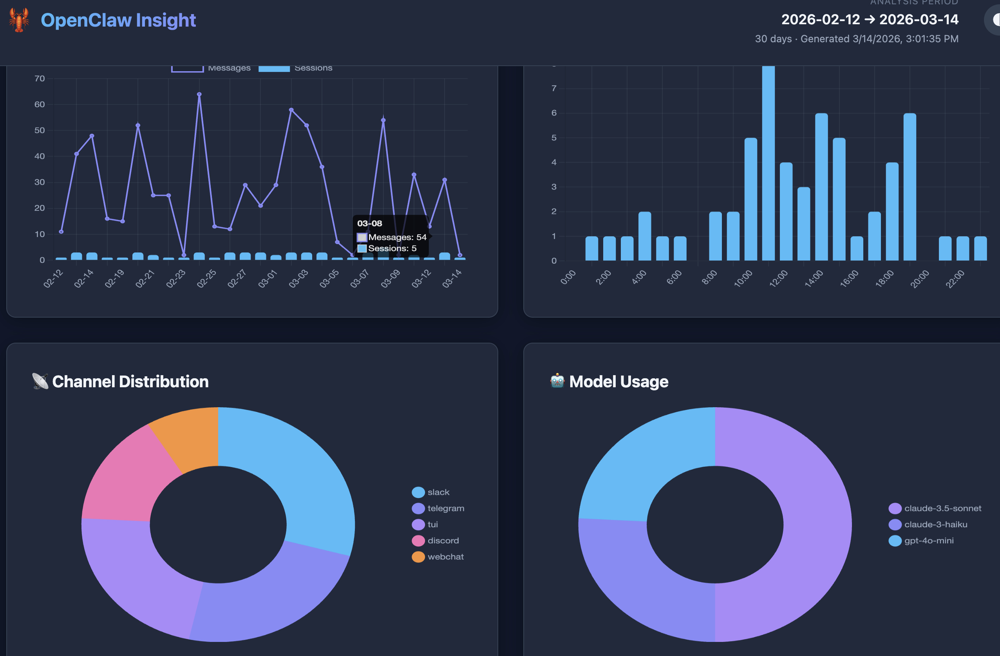
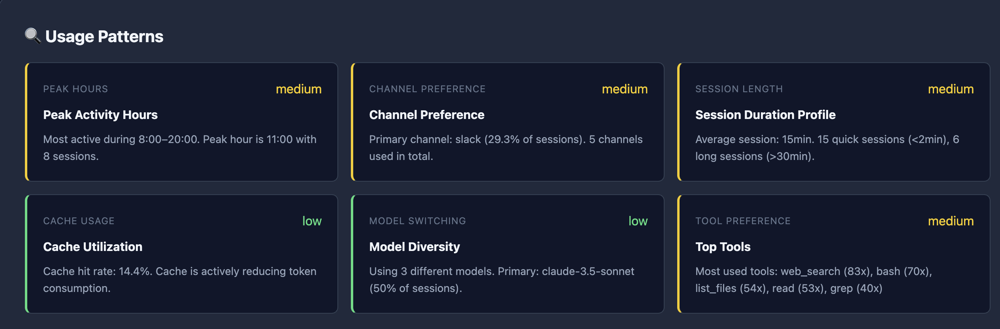
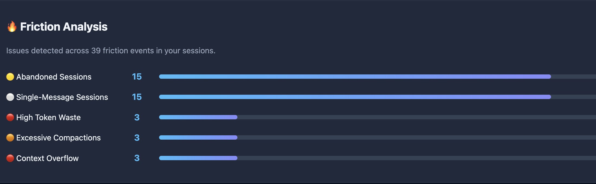
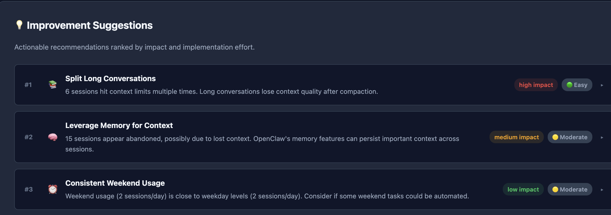
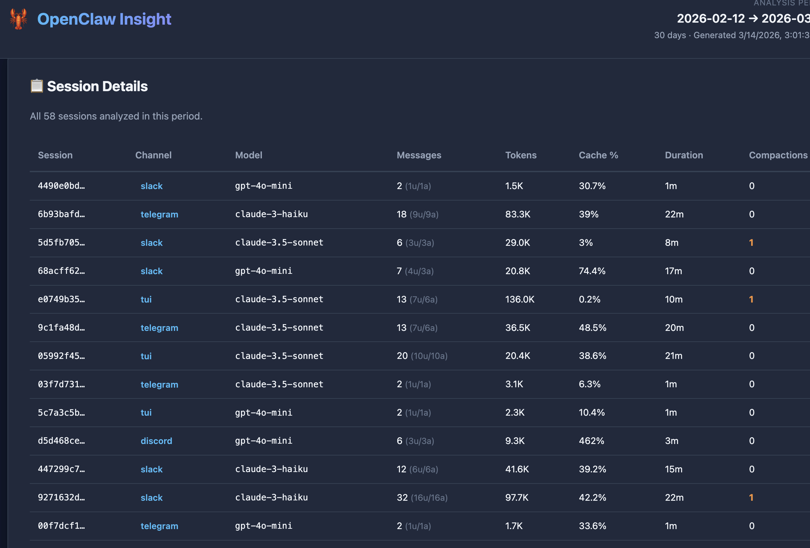

# 🦞 openclaw-insight

**English** | [简体中文](./README.zh-CN.md) | [日本語](./README.ja.md)

> Usage analytics and improvement insights for [OpenClaw](https://github.com/openclaw/openclaw) — analyze your AI assistant habits and get actionable recommendations.

Inspired by [Claude Code's `/insights` command](https://docs.anthropic.com/en/docs/claude-code), `openclaw-insight` analyzes your local OpenClaw session history and generates an interactive report with usage statistics, behavior patterns, friction analysis, and improvement suggestions.

## Features



### 📊 Comprehensive Usage Statistics
- **Session metrics**: total count, daily average, activity streaks
- **Token consumption**: input/output breakdown, cache hit rates, cost estimation
- **Temporal analysis**: daily activity charts, peak hours identification
- **Channel distribution**: per-channel session counts, token efficiency
- **Model usage**: model diversity, per-model cache performance



### 🔍 Behavior Pattern Detection
- **Peak Hours** — identifies your most active time ranges
- **Channel Preference** — analyzes platform usage distribution
- **Session Duration Profile** — categorizes quick vs deep sessions
- **Cache Utilization** — measures prompt caching effectiveness
- **Model Diversity** — tracks multi-model usage patterns
- **Tool Preferences** — ranks most-used assistant tools



### 🔥 Friction Analysis
Automatically detects pain points across your sessions:

| Friction Type | Description |
|---|---|
| High Token Waste | Sessions with excessive output/input ratios |
| Excessive Compactions | Conversations hitting context limits repeatedly |
| Abandoned Sessions | Started but barely used sessions |
| Underutilized Cache | Large sessions with zero cache hits |
| Context Overflow | Repeated context window exhaustion |
| Single-Message Sessions | Brief interactions with high overhead |



### 💡 Actionable Improvement Suggestions
Categorized recommendations with impact and effort ratings:

- **Token Efficiency** — cache optimization, verbosity control, batching
- **Channel Optimization** — multi-channel access, per-channel efficiency
- **Model Selection** — routing simple tasks to cheaper models
- **Context Management** — conversation splitting, token budgets
- **Scheduling** — usage pattern optimization
- **Memory Utilization** — cross-session context retention
- **Feature Discovery** — underused OpenClaw capabilities
- **Workflow Improvement** — conversation depth, specification clarity



### 📈 Interactive HTML Report
Beautiful dark/light theme report with:
- Chart.js-powered interactive visualizations
- Expandable suggestion cards with config snippets
- Sortable session detail table
- Responsive design for all screen sizes
- **100% local** — no data uploaded anywhere



## Installation

### One-Click Install (Recommended)

```bash
curl -fsSL https://raw.githubusercontent.com/linsheng9731/openclaw-insight/main/install.sh | bash
```

### Install a Specific Version

```bash
curl -fsSL https://raw.githubusercontent.com/linsheng9731/openclaw-insight/main/install.sh | bash -s -- --version v1.0.0
```

### Via npm

```bash
# From npm
npm install -g openclaw-insight

# Or run directly with npx
npx openclaw-insight

# Or clone and build from source
git clone https://github.com/linsheng9731/openclaw-insight.git
cd openclaw-insight
npm install
npm run build
node dist/index.js
```

## Usage

```bash
# Basic usage — analyze last 30 days, open report in browser
openclaw-insight

# Analyze last 7 days
openclaw-insight --days 7

# Output as JSON instead of HTML
openclaw-insight --format json --output report.json

# Specify a custom state directory
openclaw-insight --state-dir /path/to/.openclaw

# Analyze a specific agent
openclaw-insight --agent my-agent-id

# Verbose mode with more progress detail
openclaw-insight --verbose

# Don't auto-open browser
openclaw-insight --no-open
```

## CLI Options

| Option | Default | Description |
|---|---|---|
| `-d, --days <n>` | `30` | Number of days to analyze |
| `-m, --max-sessions <n>` | `200` | Maximum sessions to process |
| `-a, --agent <id>` | auto-detect | Agent ID to analyze |
| `-s, --state-dir <path>` | `~/.openclaw` | OpenClaw state directory |
| `-o, --output <path>` | `~/.openclaw/usage-data/report.html` | Output file path |
| `-f, --format <fmt>` | `html` | Output format (`html` or `json`) |
| `--no-open` | — | Don't auto-open the report |
| `-v, --verbose` | — | Enable verbose output |

## How It Works

```
┌─────────────────────────────────────────────────────────┐
│                   openclaw-insight                        │
├──────────┬──────────┬──────────────┬────────────────────┤
│ Collector│ Analyzer │  Suggestions │  Report Renderer   │
│          │          │              │                    │
│ sessions │ daily    │ token        │ HTML + Chart.js    │
│ .json    │ activity │ efficiency   │ interactive report │
│          │          │              │                    │
│ session  │ hourly   │ channel      │ dark/light theme   │
│ .jsonl   │ distrib  │ optimization │                    │
│ transcr. │          │              │ JSON export        │
│          │ channel  │ model        │                    │
│          │ stats    │ selection    │                    │
│          │          │              │                    │
│          │ model    │ context      │                    │
│          │ stats    │ management   │                    │
│          │          │              │                    │
│          │ patterns │ workflow     │                    │
│          │          │ improvement  │                    │
│          │ friction │              │                    │
│          │ events   │ feature      │                    │
│          │          │ discovery    │                    │
└──────────┴──────────┴──────────────┴────────────────────┘
```

### Pipeline

1. **Collection** — Reads `sessions.json` and individual `.jsonl` transcript files from `~/.openclaw/agents/{agentId}/sessions/`
2. **Analysis** — Computes daily/hourly distributions, channel stats, model stats, detects behavior patterns and friction events
3. **Suggestions** — Generates prioritized improvement recommendations based on detected patterns
4. **Rendering** — Produces a self-contained HTML report with Chart.js visualizations or a structured JSON export

### Data Sources

| Source | Path | Content |
|---|---|---|
| Session Store | `~/.openclaw/agents/{id}/sessions/sessions.json` | Session metadata, token totals, model info |
| Transcripts | `~/.openclaw/agents/{id}/sessions/{sid}.jsonl` | Full conversation history, per-turn token usage |

## Privacy

- **100% local** — All analysis runs on your machine
- **No uploads** — No data leaves your system
- **No telemetry** — The tool itself collects no usage data
- **Content-blind** — Focuses on interaction patterns, not conversation content

## Architecture

```
openclaw-insight/
├── src/
│   ├── index.ts          # CLI entry point & pipeline orchestration
│   ├── collector.ts      # Session data collection & JSONL parsing
│   ├── analyzer.ts       # Usage statistics & pattern detection
│   ├── suggestions.ts    # Improvement recommendation engine
│   ├── report.ts         # Interactive HTML report renderer
│   ├── types.ts          # TypeScript type definitions
│   └── utils.ts          # Shared utility functions
├── bin/
│   └── openclaw-insight.mjs  # CLI shim
├── package.json
├── tsconfig.json
└── README.md
```

## Development

```bash
# Install dependencies
npm install

# Build
npm run build

# Run in development mode
npm run dev

# Run tests
npm test

# Clean build artifacts
npm run clean
```

## Comparison with Claude Code Insight

| Feature | Claude Code `/insights` | openclaw-insight |
|---|---|---|
| Scope | Single coding agent | Multi-channel AI gateway |
| Channel analysis | N/A | Per-channel statistics & efficiency |
| Model tracking | Single model | Multi-model comparison |
| Tool usage | Code tools (Read, Edit, Bash) | All OpenClaw tools & plugins |
| Cache analysis | Basic | Detailed per-model cache hit rates |
| Cost estimation | N/A | Per-model cost estimation |
| Friction types | Code-specific (buggy code, wrong approach) | Gateway-specific (context overflow, token waste) |
| Report format | HTML | HTML + JSON |
| Privacy | Local | Local |

## License

MIT — see [LICENSE](LICENSE) for details.
